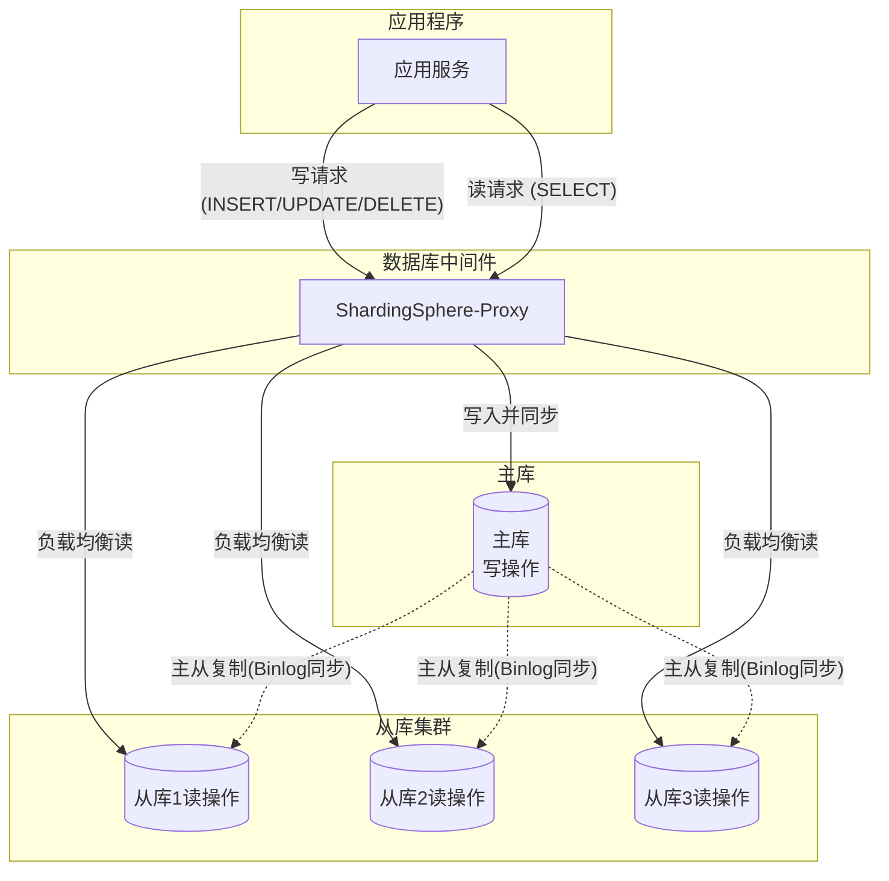
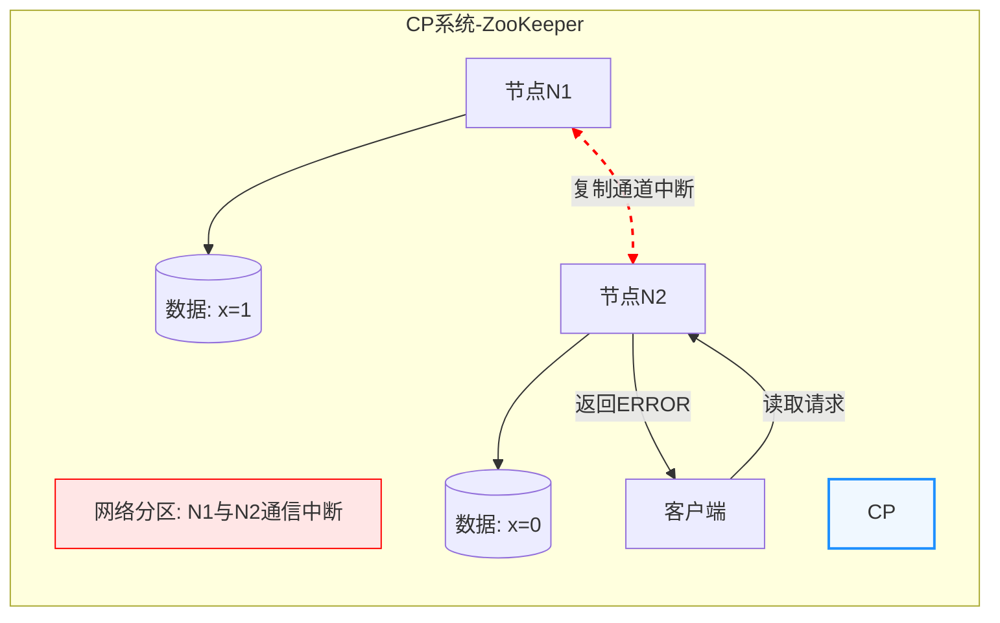
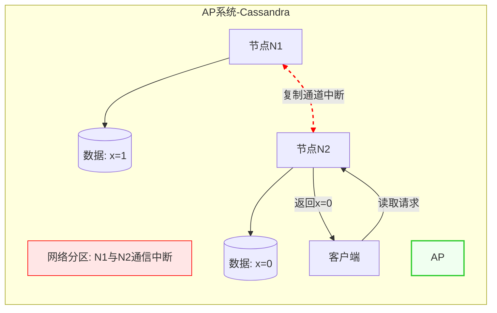
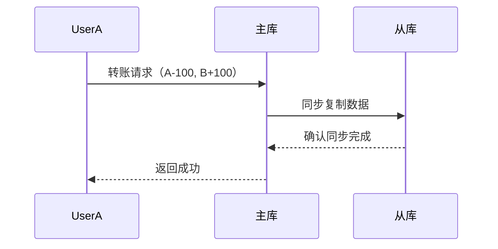
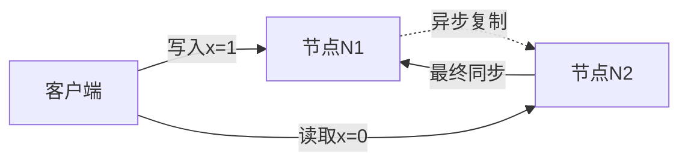

# 🐬 Mysql 读写分离
# 目录
<!-- TOC -->

- [🐬 Mysql 读写分离](#-mysql-%E8%AF%BB%E5%86%99%E5%88%86%E7%A6%BB)
- [目录](#%E7%9B%AE%E5%BD%95)
    - [1. 读写分离概念](#1-%E8%AF%BB%E5%86%99%E5%88%86%E7%A6%BB%E6%A6%82%E5%BF%B5)
    - [2. ❓ 为什么有读写分离](#2--%E4%B8%BA%E4%BB%80%E4%B9%88%E6%9C%89%E8%AF%BB%E5%86%99%E5%88%86%E7%A6%BB)
    - [3. 🛠️ 那么如何实现读写分离](#3--%E9%82%A3%E4%B9%88%E5%A6%82%E4%BD%95%E5%AE%9E%E7%8E%B0%E8%AF%BB%E5%86%99%E5%88%86%E7%A6%BB)
        - [3.1. 优点](#31-%E4%BC%98%E7%82%B9)
        - [3.2. ⚠️ 缺点](#32--%E7%BC%BA%E7%82%B9)
    - [4. 🏛️ CAP 理论](#4--cap-%E7%90%86%E8%AE%BA)
        - [4.1. 一、CAP 的组成](#41-%E4%B8%80cap-%E7%9A%84%E7%BB%84%E6%88%90)
        - [4.2. 二、CP 示例（一致性优先）](#42-%E4%BA%8Ccp-%E7%A4%BA%E4%BE%8B%E4%B8%80%E8%87%B4%E6%80%A7%E4%BC%98%E5%85%88)
            - [4.2.1. 场景：分布式数据库 ZooKeeper](#421-%E5%9C%BA%E6%99%AF%E5%88%86%E5%B8%83%E5%BC%8F%E6%95%B0%E6%8D%AE%E5%BA%93-zookeeper)
            - [4.2.2. Mermaid 图：CP 场景](#422-mermaid-%E5%9B%BEcp-%E5%9C%BA%E6%99%AF)
        - [4.3. 三、AP 示例（可用性优先）](#43-%E4%B8%89ap-%E7%A4%BA%E4%BE%8B%E5%8F%AF%E7%94%A8%E6%80%A7%E4%BC%98%E5%85%88)
            - [4.3.1. 场景：分布式数据库 Cassandra](#431-%E5%9C%BA%E6%99%AF%E5%88%86%E5%B8%83%E5%BC%8F%E6%95%B0%E6%8D%AE%E5%BA%93-cassandra)
            - [4.3.2. Mermaid 图：AP 场景](#432-mermaid-%E5%9B%BEap-%E5%9C%BA%E6%99%AF)
    - [5. 四、实际系统中的 CAP 权衡](#5-%E5%9B%9B%E5%AE%9E%E9%99%85%E7%B3%BB%E7%BB%9F%E4%B8%AD%E7%9A%84-cap-%E6%9D%83%E8%A1%A1)
    - [6. 一致性题外话](#6-%E4%B8%80%E8%87%B4%E6%80%A7%E9%A2%98%E5%A4%96%E8%AF%9D)
        - [6.1. 🔒 强一致性示例](#61--%E5%BC%BA%E4%B8%80%E8%87%B4%E6%80%A7%E7%A4%BA%E4%BE%8B)
        - [6.2. ⏳ 最终一致性示例](#62--%E6%9C%80%E7%BB%88%E4%B8%80%E8%87%B4%E6%80%A7%E7%A4%BA%E4%BE%8B)
    - [7. 那么为什么还会有数据分片](#7-%E9%82%A3%E4%B9%88%E4%B8%BA%E4%BB%80%E4%B9%88%E8%BF%98%E4%BC%9A%E6%9C%89%E6%95%B0%E6%8D%AE%E5%88%86%E7%89%87)

<!-- /TOC -->

## 读写分离概念
看字面意思读写分离也就是将读和写操作进行分离操作，分散到不同数据库实例进行处理。  
通常来说由一个主库（📝 Master）负责写操作，多个从库（📖 Slave）负责读操作。

## ❓ 为什么有读写分离
那么了解了基本的概念，我们知道了读写分离是拆分读写行为。那么为什么要有这个分离操作？主要由以下原因：

- ⚠️ **问题**：在单库架构中，**读（SELECT）** 和 **写（INSERT/UPDATE/DELETE）** 操作共用同一数据库实例。当业务量增长时，尤其在高并发场景下，读写操作会竞争数据库资源（如 CPU、磁盘 IO、连接数），导致性能下降。
  - 🛒 **示例**：电商大促期间，大量用户同时查询商品（读）和下单（写），单库可能因负载过高而响应延迟甚至宕机。
- 🛑 **问题**：单库故障会导致整个服务不可用
>  可以这么理解，如果读者玩过三角洲行动大战场，那么这游戏有一张地图，他有一个点是A1,这个点就是典型的单库行为，所有进攻方集火一个 A1 点。很难支撑火力进攻，防守全靠队友[硬件资源]配置，当进攻方到达了 B1,B2那么进攻方需要向这两个点进行进攻，分摊了火力，防守方有更多的时间调整。

## 🛠️ 那么如何实现读写分离
-  **主从复制**：主库负责写操作，并将数据变更同步到从库，从库只提供读操作。
-  **中间件/代理**：如 ShardingSphere、MyCat 等，自动将写请求路由到主库，读请求路由到从库。
-  **应用层实现**：业务代码根据操作类型选择不同的数据源。

> 1. 🖥️ **应用程序**：发起读（SELECT）和写（INSERT/UPDATE/DELETE）请求。
>
> 2.  **数据库中间件**（如 ShardingSphere-Proxy）:
>   - 将写请求路由到  **主库**。
>   - 将读请求按负载均衡策略（如轮询、权重）分发到  **从库集群**。
>
> 3.  **主库**：处理所有写操作，并通过 **主从复制**（如 MySQL Binlog）同步数据到从库。
>
> 4.  **从库集群**：提供读服务，数据与主库最终一致，支持水平扩展以提升读性能。

###  优点
-  **提升读性能**：读请求分散到多个从库，极大提升并发能力。
-  **减轻主库压力**：主库只处理写操作，写入性能更高。
-  **高可用性**：主库故障时，从库可临时承担部分读请求。
-  **易扩展**：可通过增加从库数量横向扩展读能力。

### ⚠️ 缺点
-  **主从延迟导致数据不一致**
-  **主库单点写入瓶颈**
-  **数据最终一致性的复杂性**
-  **事务处理复杂**
-  **系统复杂性提升**

## 🏛️ CAP 理论

### 一、CAP 的组成

| **缩写** | **名称**                | **定义**                                                                 |
|----------|-------------------------|--------------------------------------------------------------------------|
| **C**    | 一致性 (Consistency)    | 所有节点在同一时间看到的数据完全一致。                                   |
| **A**    | 可用性 (Availability)   | 每个请求都能获得可用的响应。                                 |
| **P**    | 分区容忍性 (Partition Tolerance) | 系统在节点间网络中断时仍能继续运行。                                     |

**核心矛盾**：网络分区（P）必然发生时，系统只能选择 **CP** 或 **AP**，无法同时满足三者。

---

### 二、CP 示例（一致性优先）

#### 场景：分布式数据库 ZooKeeper
- **行为**：当网络分区发生时，系统优先保证数据一致性，部分节点不可用。
- **示例流程**：
  1. 客户端向节点 N1 写入数据 `x=1`。
  2. 网络分区导致 N1 和 N2 无法通信。
  3. 客户端尝试从 N2 读取数据：
     - **CP 系统**：N2 拒绝响应（返回错误），避免返回可能过时的数据。
     - **AP 系统**：N2 返回旧数据 `x=0`，保证可用性。

#### Mermaid 图：CP 场景

### 三、AP 示例（可用性优先）

#### 场景：分布式数据库 Cassandra
- **行为**：当网络分区发生时，系统优先保证可用性，允许数据短暂不一致。
- **示例流程**：
  1. 客户端向节点 N1 写入数据 `x=1`。
  2. 网络分区导致 N1 和 N2 无法通信。
  3. 客户端从 N2 读取数据：
     - **AP 系统**：N2 返回旧数据 `x=0`，保证可用性。
  4. 网络恢复后，系统通过冲突解决机制（如最后写入胜利）同步数据。

#### Mermaid 图：AP 场景

## 四、实际系统中的 CAP 权衡

|  系统类型       |  CAP 选择 |  典型代表               |  适用场景             |
|----------------|----------|------------------------|----------------------|
| 强一致性系统   | CP       | ZooKeeper, etcd, HBase | 💰 金融交易、配置管理   |
| 高可用系统     | AP       | Cassandra, DynamoDB    | 🌐 社交网络、实时日志   |

##  一致性题外话
一致性分为弱一致性、强一致性和最终一致性

### 🔒 强一致性示例

场景：银行转账  
操作流程：
- 👤 用户A向用户B转账100元。
- 🏦 系统同步锁定A和B的账户，确保A账户余额≥100元。
- 💸 执行转账：A账户扣减100元，B账户增加100元。
- ✅ 所有节点确认后释放锁，返回成功。

### ⏳ 最终一致性示例
场景：分布式数据库写入  
操作流程：
- 🖥️ 客户端向节点N1写入数据 x=1。
- 🔄 N1异步复制数据到N2，期间N2仍为旧值 x=0。
- 🖥️ 客户端从N2读取到旧值 x=0。
- ✅ 最终N2同步完成，数据变为 x=1。

> 📝 也就是说最终一致性关键点在“最终”二字，最终和时间相关，一旦发起复制数据操作，当时可能不是和节点 N1 一致的，随着异步复制的完成最终会变成一致性。

> 🤔 这里为什么不描述​​弱一致性​​？其实最终一致性算是弱一致性的子集，它承诺会最终一致，这就是和弱一致性的区别。弱一致性系统不保证读取到最新数据，允许数据在不同节点间存在不一致，且不承诺何时会一致。

---

##  那么为什么还会有数据分片
读写分离分散了读写操作的压力，但是并没有分散存储的压力。为了满足数据存储的要求，可以使用数据分片的方式将数据分散到多台机器上，相关数据分片的知识请阅读 [🗂️ 数据分片](3.数据分片.md)