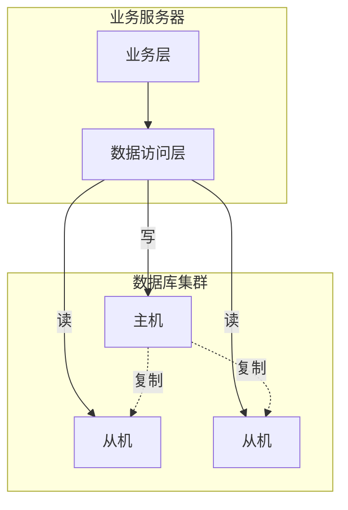
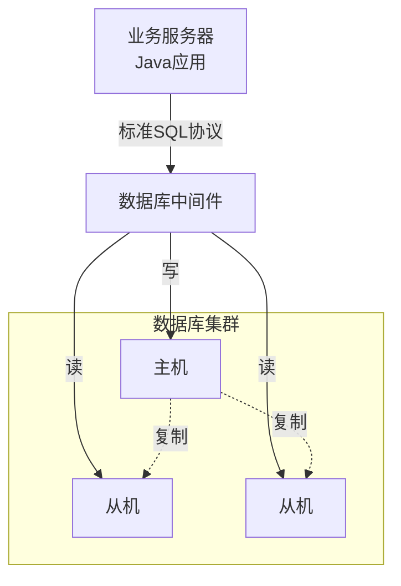

# 目录
<!-- TOC -->

- [目录](#%E7%9B%AE%E5%BD%95)
- [实现方式](#%E5%AE%9E%E7%8E%B0%E6%96%B9%E5%BC%8F)
    - [1. 程序代码封装](#1-%E7%A8%8B%E5%BA%8F%E4%BB%A3%E7%A0%81%E5%B0%81%E8%A3%85)
    - [2. 中间件](#2-%E4%B8%AD%E9%97%B4%E4%BB%B6)
    - [3. 常见中间件](#3-%E5%B8%B8%E8%A7%81%E4%B8%AD%E9%97%B4%E4%BB%B6)

<!-- /TOC -->

# 实现方式
读写分离和数据分片具体的实现方式: `程序代码封装` 和 `中间件`

## 程序代码封装
程序代码封装指的是在代码中抽象一个`数据访问层`. 实现读写分离和数据库服务器连接管理

## 中间件
所谓的中间件指的是独立一套单独的系统，实现读写分离和数据库连接的管理。

## 常见中间件
- **ShardingSphere**  
  开源、功能强大，支持分库分表、读写分离、分布式事务等，兼容多种数据库。

- **MyCat**  
  国人开发的开源数据库中间件，支持分库分表、读写分离，适合中小型项目。

- **Cobar**  
  阿里巴巴开源的数据库中间件，适合MySQL分库分表场景。

  - **TDDL**  
  淘宝分布式数据层，主要用于阿里内部。

- **Vitess**  
  YouTube开源，适合大规模MySQL集群的分片和管理
